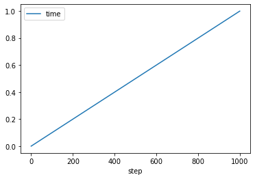
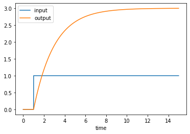
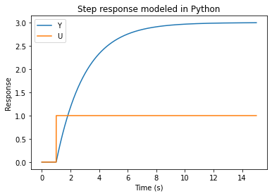
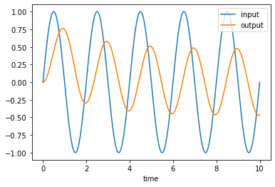
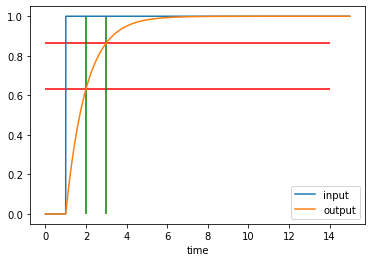

# discrete_tf - Example2

Very simple discrete transfer function.


# Python Setup


```python
import ctypes
from rtwtypes import *
```


```python
import os
dll_path = os.path.abspath('discrete_tf_win64.dll')
dll = ctypes.windll.LoadLibrary(dll_path)
# Model entry point functions
model_initialize = dll.discrete_tf_initialize
model_step = dll.discrete_tf_step
model_terminate = dll.discrete_tf_terminate
```


```python
InputSignal = real_T.in_dll(dll, 'InputSignal')
num = (real_T*2).in_dll(dll,  "num")
den = (real_T*2).in_dll(dll,  "den")
```


```python
OutputSignal = real_T.in_dll(dll, 'OutputSignal')
SimTime = real_T.in_dll(dll, 'SimTime')
```

Validate that the transfer function numerator and denominator generated in Matlab match those generated with Python tools.

```
matlab tf() -> matlab c2d() -> Simulink Tunable Parameter -> dll -> Python == control.c2d(control.TransfenFunction)
```


```python
import control
import numpy as np
# How fast the simulink model is running.
Ts=1e-3
# Static Gain
K = 3
# Time Constant.
tau = 2
sys = control.TransferFunction([K], [tau, 1])
sysd = control.c2d(sys, Ts)
sysd
```


$$\frac{0.0015}{z - 0.9995}\quad dt = 0.001$$


```python
list(num)
```


    [0.0, 0.0014996250624921886]


```python
list(den)
```


    [1.0, -0.9995001249791693]


```python
np.isclose(num[1], sysd.num)
```


    array([[[ True]]])


```python
np.isclose(den[:], sysd.den)
```


    array([[[ True,  True]]])


# Running The Model.

Run the model and store the step, input, output and simulation time to a pandas dataframe.


```python
model_initialize();
rows = list()
for step in range(1000):
    row_tmp = {
    'step': model_step(),
    'time': float(SimTime.value),
    'input': float(InputSignal.value),
    'output': float(OutputSignal.value),
    }
    rows.append(row_tmp)
```


```python
import pandas as pd
df = pd.DataFrame(rows)
df
```


<div>
<style scoped>
    .dataframe tbody tr th:only-of-type {
        vertical-align: middle;
    }

    .dataframe tbody tr th {
        vertical-align: top;
    }

    .dataframe thead th {
        text-align: right;
    }
</style>
<table border="1" class="dataframe">
  <thead>
    <tr style="text-align: right;">
      <th></th>
      <th>step</th>
      <th>time</th>
      <th>input</th>
      <th>output</th>
    </tr>
  </thead>
  <tbody>
    <tr>
      <th>0</th>
      <td>0</td>
      <td>0.000</td>
      <td>0.0</td>
      <td>0.0</td>
    </tr>
    <tr>
      <th>1</th>
      <td>1</td>
      <td>0.001</td>
      <td>0.0</td>
      <td>0.0</td>
    </tr>
    <tr>
      <th>2</th>
      <td>2</td>
      <td>0.002</td>
      <td>0.0</td>
      <td>0.0</td>
    </tr>
    <tr>
      <th>3</th>
      <td>3</td>
      <td>0.003</td>
      <td>0.0</td>
      <td>0.0</td>
    </tr>
    <tr>
      <th>4</th>
      <td>4</td>
      <td>0.004</td>
      <td>0.0</td>
      <td>0.0</td>
    </tr>
    <tr>
      <th>...</th>
      <td>...</td>
      <td>...</td>
      <td>...</td>
      <td>...</td>
    </tr>
    <tr>
      <th>995</th>
      <td>995</td>
      <td>0.995</td>
      <td>0.0</td>
      <td>0.0</td>
    </tr>
    <tr>
      <th>996</th>
      <td>996</td>
      <td>0.996</td>
      <td>0.0</td>
      <td>0.0</td>
    </tr>
    <tr>
      <th>997</th>
      <td>997</td>
      <td>0.997</td>
      <td>0.0</td>
      <td>0.0</td>
    </tr>
    <tr>
      <th>998</th>
      <td>998</td>
      <td>0.998</td>
      <td>0.0</td>
      <td>0.0</td>
    </tr>
    <tr>
      <th>999</th>
      <td>999</td>
      <td>0.999</td>
      <td>0.0</td>
      <td>0.0</td>
    </tr>
  </tbody>
</table>
<p>1000 rows × 4 columns</p>
</div>


```python
df.plot("step", "time")
```


    <AxesSubplot:xlabel='step'>


    

    


# Step Response

Generate a step response to test the transfer function.

Unit step @ 1s.


```python
model_initialize();
InputSignal.value=0.0;
rows = list()
for step in range(int(15*1e3)):
    if step>=1*1e3:
        InputSignal.value=1.0
    else:
        InputSignal.value=0.0
    row_tmp = {
    'step': model_step(),
    'time': float(SimTime.value),
    'input': float(InputSignal.value),
    'output': float(OutputSignal.value),
    }
    rows.append(row_tmp)
df = pd.DataFrame(rows)
df
```


<div>
<style scoped>
    .dataframe tbody tr th:only-of-type {
        vertical-align: middle;
    }

    .dataframe tbody tr th {
        vertical-align: top;
    }

    .dataframe thead th {
        text-align: right;
    }
</style>
<table border="1" class="dataframe">
  <thead>
    <tr style="text-align: right;">
      <th></th>
      <th>step</th>
      <th>time</th>
      <th>input</th>
      <th>output</th>
    </tr>
  </thead>
  <tbody>
    <tr>
      <th>0</th>
      <td>0</td>
      <td>0.000</td>
      <td>0.0</td>
      <td>0.000000</td>
    </tr>
    <tr>
      <th>1</th>
      <td>1</td>
      <td>0.001</td>
      <td>0.0</td>
      <td>0.000000</td>
    </tr>
    <tr>
      <th>2</th>
      <td>2</td>
      <td>0.002</td>
      <td>0.0</td>
      <td>0.000000</td>
    </tr>
    <tr>
      <th>3</th>
      <td>3</td>
      <td>0.003</td>
      <td>0.0</td>
      <td>0.000000</td>
    </tr>
    <tr>
      <th>4</th>
      <td>4</td>
      <td>0.004</td>
      <td>0.0</td>
      <td>0.000000</td>
    </tr>
    <tr>
      <th>...</th>
      <td>...</td>
      <td>...</td>
      <td>...</td>
      <td>...</td>
    </tr>
    <tr>
      <th>14995</th>
      <td>14995</td>
      <td>14.995</td>
      <td>1.0</td>
      <td>2.997258</td>
    </tr>
    <tr>
      <th>14996</th>
      <td>14996</td>
      <td>14.996</td>
      <td>1.0</td>
      <td>2.997259</td>
    </tr>
    <tr>
      <th>14997</th>
      <td>14997</td>
      <td>14.997</td>
      <td>1.0</td>
      <td>2.997260</td>
    </tr>
    <tr>
      <th>14998</th>
      <td>14998</td>
      <td>14.998</td>
      <td>1.0</td>
      <td>2.997262</td>
    </tr>
    <tr>
      <th>14999</th>
      <td>14999</td>
      <td>14.999</td>
      <td>1.0</td>
      <td>2.997263</td>
    </tr>
  </tbody>
</table>
<p>15000 rows × 4 columns</p>
</div>


```python
df.plot(x='time', y=["input", "output"])
```


    <AxesSubplot:xlabel='time'>


    

    


```python
T, yout, xout = control.forced_response(sysd, df.time, df.input)

plt.plot(T, yout, T, df.input)
plt.legend(["Y", "U"])
plt.xlabel("Time (s)")
plt.ylabel("Response")
plt.title("Step response modeled in Python")
```


    Text(0.5, 1.0, 'Step response modeled in Python')


    

    


```python
# Max error
np.max(yout-df.output)
```


    9.903189379656396e-14


Sending the Simulink shared library has the same response (as it should) to the same signal tested with the python `control` library. Therefore it is reasonable to assume all other higher level algorithms tested on Simulink should work correctly in Python.

# Sinewave Input

Generate a sinewave with ``numpy``. Plot the input and output of the transfer function with ``pandas``.


```python
model_initialize();
rows = list()
f = 0.5 # Hz
for step in range(int(10*1e3)):
    InputSignal.value=np.sin(2*np.pi*step*f/1e3)
    row_tmp = {
    'step': model_step(),
    'time': float(SimTime.value),
    'input': float(InputSignal.value),
    'output': float(OutputSignal.value),
    }
    rows.append(row_tmp)
df = pd.DataFrame(rows)
df.plot(x='time', y=["input", "output"])
```


    <AxesSubplot:xlabel='time'>


    

    


```python
T, yout, _ = control.forced_response(sysd, df.time, df.input)
plt.plot(T, yout, df.time, df.output)
plt.legend(["control.forced_response", "simulink shared library response"])
```


    <matplotlib.legend.Legend at 0x1ba207c0c10>


    

    


# Changing the TransferFunction

Change the transfer function to have a static gain of 1 and a timeconstant of 1s.

Mark $1\tau$ and $2\tau$ on the graph.


```python
# How fast the simulink model is running.
Ts=1e-3
# Static Gain
K = 1
# Time Constant.
tau = 1
sys = control.TransferFunction([K], [tau, 1])
sysd = control.c2d(sys, Ts)
sysd
```


$$\frac{0.0009995}{z - 0.999}\quad dt = 0.001$$


```python
num[1]=sysd.num[0][0][0]
den[0] = sysd.den[0][0][0]
den[1] = sysd.den[0][0][1]

model_initialize();
InputSignal.value=0.0;
rows = list()
for step in range(int(15*1e3)):
    if step>=1*1e3:
        InputSignal.value=1.0
    else:
        InputSignal.value=0.0
    row_tmp = {
    'step': model_step(),
    'time': float(SimTime.value),
    'input': float(InputSignal.value),
    'output': float(OutputSignal.value),
    }
    rows.append(row_tmp)
df = pd.DataFrame(rows)
df.plot(x='time', y=["input", "output"])
plt.hlines([1-np.exp(-1), 1-np.exp(-2)], xmin=0, xmax=14, colors="r")
plt.vlines([2, 3], ymin=0, ymax=1, colors="g")
```


    <matplotlib.collections.LineCollection at 0x1ba202d73d0>


    

    

