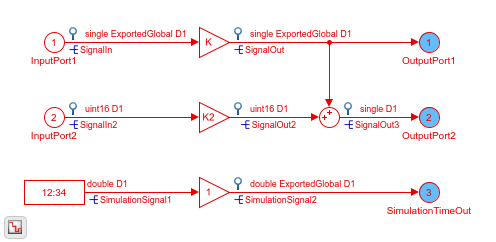
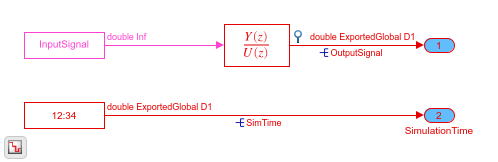
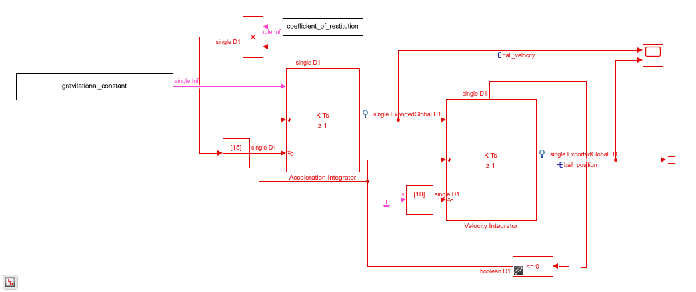

# Python SimulinkDLL

Run your Simulink models & libraries in Python.

## Motivation

1. Running model in the loop tests with Simulink becomes time consuming with Matlab & Simulink overhead. There are ways to reduce it (Model reference, etc) however nothing has shown to be as fast as a precompiled shared library.

2. Python has a very mature set of tools and packages to automate testing.

3. Testing can be distributed to machines without Matlab/Simulink licenses.

## Use cases

1. Use Python and it's ecosystem to run complex Simulink models.
2. Use Python & pytest to run Model-in-the-Loop (MIL) tests on Simulink subsystems.
3. Give Simulink algorithms to developers without Matlab/Simulink licenses to use.
4. Start a programming language war at your company.

##  Disclaimer

This repository is a set of instructions, with examples, on how to create a Pythonic wrapper for Simulink models. It **is not** a turnkey Python module to do this:

```python
import simulinkdll
simulinkdll.run("my_model.slx")
```

For a given library or model this should only need done when the Simulink interface changes.

### High level instructions.

1. [Create a shared library in Simulink.](https://www.mathworks.com/help/ecoder/ug/creating-and-using-host-based-shared-libraries.html)
2. Create Python representations of all items in the header file.
3. Open the DLL in Python and run the model.

# Examples

### [Simple DLL Export](https://nbviewer.jupyter.org/github/dapperfu/python_SimulinkDLL/blob/master/Example1/dllModel.ipynb)

For demonstrating minimal dll functionality and the steps required to run a model in Python.



### [Discrete Transfer Function](https://nbviewer.jupyter.org/github/dapperfu/python_SimulinkDLL/blob/master/Example2/discrete_tf-python_class.ipynb)



A simple discrete transfer function. Compiled with a 1st order low pass filter.

There are multiple examples. Windows & Linux examples are low level ctypes wrappers to run the transfer function. The Pythonic Example using a class in [discretetf.py](https://github.com/dapperfu/python_SimulinkDLL/blob/master/Example2/discretetf.py) to interact with the model in a more Pythonic way.

- [Windows Example](https://nbviewer.jupyter.org/github/dapperfu/python_SimulinkDLL/blob/master/Example2/discrete_tf.ipynb)
- [Linux Example](https://nbviewer.jupyter.org/github/dapperfu/python_SimulinkDLL/blob/master/Example2/discrete_tf-linux.ipynb)
- [Pythonic Example](https://nbviewer.jupyter.org/github/dapperfu/python_SimulinkDLL/blob/master/Example2/discrete_tf-python_class.ipynb) - create a [TransferTF python](https://github.com/dapperfu/python_SimulinkDLL/blob/master/Example2/discretetf.py) class to interact with the model.

### 

Adapted from [Mathworks's Simulation of a Bouncing Ball](https://www.mathworks.com/help/simulink/slref/simulation-of-a-bouncing-ball.html)



# Questions, Issues, & Feedback

https://github.com/AutomotiveDevops/python_SimulinkDLL/issues


Google Indexing:

MIL Python, Model-In-The-Loop Python.
SIL Python, Software-In-The-Loop Python.
Model-in-the-loop testing with Python.
Software-in-the-loop testing with Python.
Using Python for SIL testing. Using Python for MIL testing.
